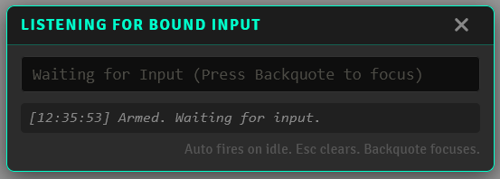
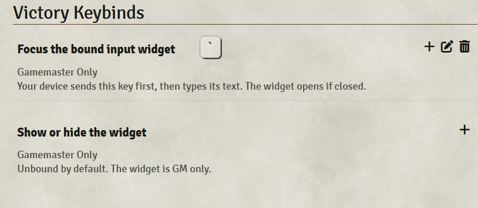

DatJavaClass here, I am terrible at writing readme files, great at talking people through things, bad a putting pen to paper or finger to keyboard on how to. So yes, I did have an LLM write this readme. So it could be coherent. So it could be understood. So you could just maybe get an idea of what I build here. IF the fact that a readme is coherent offends you? I am sorry. If not, I hope what I made is useful and I genuinely hope it helps you have fun in your game. Roll on my friends, Roll on.

# Victory Keybinds

I run my table off an Elgato Stream Deck. One key opens the loot search, another fires the initiative macro, a third flips the sidebar to combat. Every one of those keys does the same two things: it presses a key, then it types a string. That is the whole trick, and Victory Keybinds is the half of it that lives inside Foundry.

It is not a Stream Deck module. There is no reason it won't work with anything that has programmable inputs: the macro keys on a Razer or Logitech keyboard, the side buttons on a Razer or Logitech mouse, a Corsair keypad, a cheap macro pad off the internet. If the device can send a keystroke and then a line of text, it can drive this.

# What is Victory Keybinds?

A small draggable widget on the GM's screen that waits for input. One bound key (backtick out of the box) gives it focus. The device then types a UUID or a keyword. When the typing stops, the widget fires whatever it got: a macro runs, an item is used, a sheet opens, a journal opens, the sidebar jumps to a tab. The field clears, the resolved name echoes below it, and the widget waits again.

No Enter. That's deliberate. Firing on Enter kept auto submitting the dialogs the fired macros opened, so the widget fires on a short idle timer instead. Your device sends the key, a small delay, the text, and nothing else.

## Install

Paste this into Foundry's Install Module manifest field:

https://github.com/DatJavaClass/VictoryKeybinds/releases/latest/download/module.json

Enable it. The widget opens on load for the GM.

Two keybindings live under Configure Controls: the focus key, which you can rebind if backtick is already spoken for, and an unbound toggle to show or hide the widget.

## What you can send

| Send | Does |
| --- | --- |
| `Macro.<id>` or a bare world macro id | Runs the macro |
| `Compendium.<pack>.Macro.<id>` | Runs a compendium macro |
| `Actor.<id>.Item.<id>`, `Item.<id>`, `Compendium.<pack>.Item.<id>` | Uses the item, on use scripts included |
| `=Actor.<id>` | Opens the sheet, nothing else |
| `<JournalEntry.<id>` | Opens the journal |
| `>chat`, `>combat`, `>scenes`, any tab name | Jumps the sidebar to that tab |
| `inventory` | Opens the first item on the selected token named like inventory |
| `newPC`, `newNPC` | Opens Create Actor preset to that type, case sensitive |

On the device side, one button is one action: send the focus key, wait about 200 milliseconds, type the string. That is the entire setup, and it is the same on every brand.

## Settings

Idle delay in milliseconds, open on load, and a debug mode that logs every keystroke and resolution to the console with a badge on the widget. All per client.

Built and Vibed with AI.
